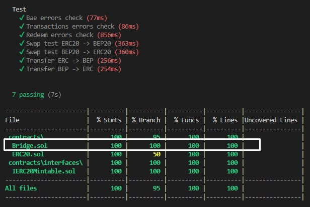

  

Написаны контракты моста Bridge и развернут в сетях:
* [Ethereum](https://rinkeby.etherscan.io/address/0x15502D439C673f295fc4e036418d101C5Bfc0182)  
* [BSC](https://testnet.bscscan.com/address/0x9c3AAE82FDF24bA8221E61516DE58803AA04d5a5)    

Для каждой из сетей выпущен токен для кроссчейн свапа:  
* [ERCCT](https://rinkeby.etherscan.io/token/0x50B5bD066041b750ae4f0c578D1a60347F47Ab24)  
* [BEPCT](https://testnet.bscscan.com/token/0xd4813D166793c3B61903082e19DE30b3Eb3cd078)   

Написан hardhat task, который запускает прослушивание событий в одной из сети и автоматически вызывает redeem() от имени администратора.